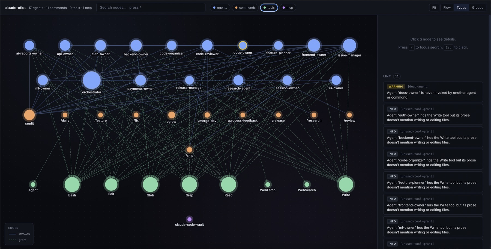
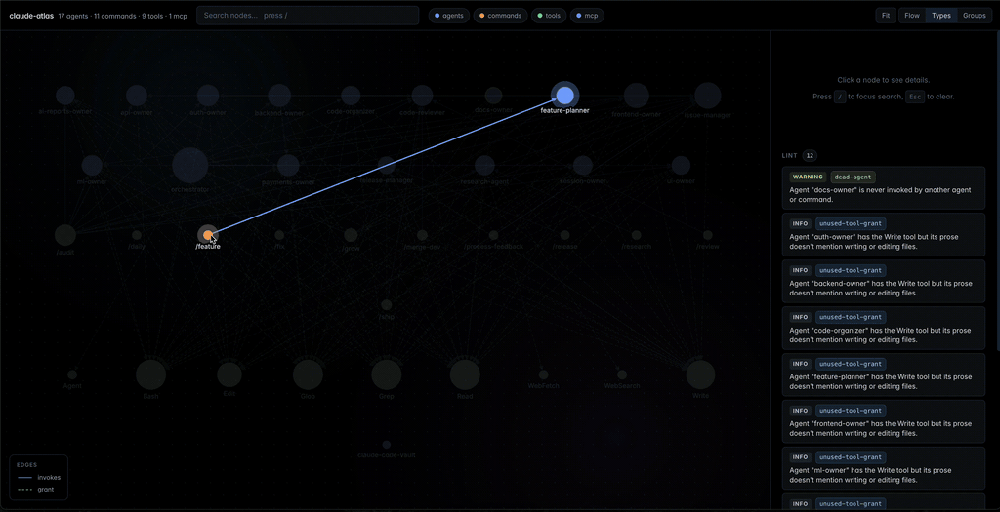

<div align="center">

# claude-atlas

**Map and lint Claude Code agent configs — agents, commands, tools, permissions as a navigable graph.**

[](https://www.npmjs.com/package/claude-atlas)
[](LICENSE)
[](package.json)

</div>

---

As your agent config grows past a handful of agents, it stops being legible at a glance. Who invokes whom? Which agent owns the Write tool but never writes? Which agent does nothing at all? There is no linter, no dependency graph, no refactoring tool.

`claude-atlas` is that tool. It reads `agents/`, `commands/`, `.mcp.json`, and `settings*.json`, builds a graph, and gives you three things:

1. **An interactive visualization** — see your agent system laid out with typed edges (`invokes`, `grant`).
2. **A linter** — dead agents, missing references, delegation cycles, unused tool grants.
3. **Structured JSON** — pipe the graph into anything else.

No LLM calls. No cloud. No telemetry. Just your config, made visible.

> ⚠️ **Status: early, active development.** Public development, MIT-licensed, source you can read. See the [roadmap](#roadmap).

<p align="center">
  
  <br />
  <sub><em>17 agents, 11 commands, 9 tools — Types layout with lint findings color-coded by rule.</em></sub>
</p>

## How it looks in practice

Walk-through on a real project with 17 agents + 11 commands.

### `claude-atlas scan .claude`

```
Scanned /Users/you/project/.claude
  17 agents, 11 commands, 9 tools, 1 MCP servers
  147 edges
  110 allow rules, 0 deny rules
```

High-level sanity check — how dense is your config, how much graph does it actually form?

### `claude-atlas lint .claude`

```
WARNING (1)
  [dead-agent] Agent "docs-owner" is never invoked by another agent or command.

INFO (10)
  [unused-tool-grant] Agent "auth-owner" has the Write tool but its prose doesn't mention writing or editing files.
  ...
```

**Dead agents** — defined but never called. **Unused grants** — tools you handed out that the agent's own prose doesn't ask for. Both are cheap to accumulate and expensive to notice by hand.

Exit code is `1` if any `ERROR`-level findings show up (e.g. a command referencing an agent that doesn't exist), so you can wire it straight into CI.

### `claude-atlas serve .claude`

Interactive graph at `http://localhost:4000`:

- Nodes colored by type: agent (blue), command (orange), tool (green), MCP server (purple).
- Edges colored by kind: `invokes` (solid blue), `grant` (dashed green).
- Click a node → sidebar with description, tools granted, agents it invokes, agents that invoke it.
- Full lint report pinned to the sidebar.

<p align="center">
  
  <br />
  <sub><em>The viewer in motion — hover a node to trace its edges, click to see tools, permissions, and lint findings.</em></sub>
</p>

Renders cold in under a second via cytoscape.js.

### `claude-atlas duplicates .claude`

```
1 duplicate candidate(s):

  Agents "frontend-owner" and "session-owner" look similar (score 0.57). Consider merging.
```

Shortcut that only surfaces `duplicate-candidate` findings from the linter, sorted by similarity. Similarity is Jaccard on tokenized description + prose, blended 70/30 with tool-grant overlap.

### `claude-atlas rename <old> <new> [path] [--dry-run]`

```
Would rewrite 3 file(s), 5 change(s):

  agents/reviewer.md
    L2 [name]    name: reviewer  →  name: code-reviewer
    L7 [mention] The reviewer reads a diff…  →  The code-reviewer reads a diff…
  agents/planner.md
    L8 [mention] …hands the plan to the reviewer…  →  …hands the plan to the code-reviewer…
  commands/review.md
    L5 [mention] Invoke the reviewer agent…  →  Invoke the code-reviewer agent…

Dry run — no files changed. Re-run without --dry-run to apply.
```

Rewrites the defining agent's frontmatter `name:` and every word-boundary mention across `agents/` and `commands/`. Matches the scanner's reference detection, so anything the graph counts as an invocation gets updated. Exits non-zero if `<new>` would collide with an existing agent or command slug. `--json` prints a structured diff for scripting.

Filenames stay put for now — `agents/code-reviewer.md` keeps its name after renaming the agent inside. Rename the file yourself if you want the slug to move with it.

### `claude-atlas who-can <permission> [path] [--deny]`

```
who can run: Bash(git push)

  Allow rules matched:
    - Bash(git *)

1 agent(s):

  shipper
    tool grants: Bash
    via rules:   Bash(git *)
```

Resolves a permission query — `Tool` or `Tool(spec)` — against `settings.json`'s `allow`/`deny` intersected with each agent's tool grants. `Bash(git push)` is allowed by `Bash(git *)` (glob match, `*` → `.*`). `--deny` inverts: `who-can "Bash(git push --force)" --deny` shows every agent a deny rule blocks — useful when reviewing a permission-widening PR ("if I add this deny, who loses what?").

The viewer surfaces the same data in the sidebar: click an agent and you get a **Permissions** section listing every allow/deny rule applicable to that agent's tool grants, color-coded.

### `claude-atlas lint --format github` + `claude-atlas init-ci`

Run the linter on every PR without setting up a token or a third-party action.

```bash
claude-atlas init-ci
# ✓ Wrote .github/workflows/atlas.yml
git add .github/workflows/atlas.yml && git commit -m "chore: add claude-atlas CI" && git push
```

The scaffolded workflow runs on any PR or push that touches `.claude/` or `.mcp.json` and executes:

```bash
npx --yes claude-atlas lint .claude --format github
```

`--format github` emits [GitHub Actions workflow commands](https://docs.github.com/actions/using-workflows/workflow-commands-for-github-actions) — one per finding — which GitHub parses from stdout and renders as inline PR annotations pinned to the offending file. `missing-agent-ref` (error) fails the check; `dead-agent`, `missing-description`, `delegation-cycle` (warning) and `unused-tool-grant`, `duplicate-candidate` (info) surface as annotations but don't block the merge.

No `GITHUB_TOKEN` setup required — workflow commands are rendered from stdout, not through the API. If the file already exists, `init-ci` refuses; pass `--force` to overwrite.

### `--json` everywhere

```bash
claude-atlas scan . --json | jq '.agents[] | select(.tools | length > 5)'
claude-atlas lint . --json | jq '[.[] | select(.level == "error")] | length'
```

Both `scan` and `lint` support `--json` for scripting.

## Install

```bash
npx claude-atlas serve .claude
```

Or clone and run locally:

```bash
git clone https://github.com/bernabranco/claude-atlas.git
cd claude-atlas
npm install

node bin/cli.js scan /path/to/your/repo/.claude
node bin/cli.js lint /path/to/your/repo/.claude
node bin/cli.js serve /path/to/your/repo/.claude
```

Node 20+.

## What gets scanned

Path defaults to `./.claude`, but the folder name isn't load-bearing — pass any path with the Claude Code layout (custom `agents/` root, monorepo-vendored config, etc.).

| Source (relative to the path you pass) | Extracted |
|---|---|
| `agents/*.md` | Name, description, tool grants (frontmatter), prose-mentioned delegations |
| `commands/*.md` | Name, description, agents it invokes |
| `settings.json` + `settings.local.json` | Allow / deny permission rules |
| `../.mcp.json` (parent directory) | MCP servers declared for the project |

Agents must use Claude Code's frontmatter shape (`name`, `description`, `tools: [...]`). Agent directories from other frameworks (OpenAI Assistants, CrewAI, etc.) use a different schema and won't parse meaningfully.

Agent→Agent delegation is detected by word-boundary matching on agent names in each agent's prose — imperfect but cheap, and catches most real orchestration patterns.

## Linters shipped

| Code | Level | What it catches |
|---|---|---|
| `dead-agent` | warning | Agent defined but never invoked by another agent or command |
| `missing-agent-ref` | error | Command or agent mentions a name that doesn't exist |
| `missing-description` | warning | Agent or command has no `description` in its frontmatter — hurts discoverability in pickers and sidebars |
| `delegation-cycle` | warning | A invokes B invokes A |
| `unused-tool-grant` | info | Agent has `Write` granted but its prose doesn't mention writing/editing |
| `duplicate-candidate` | info | Two agents (or two commands) have overlapping prose + tools and may be worth merging |

More on the [roadmap](#roadmap).

## Roadmap

- [x] **Scanner** — `.claude/` → structured graph (agents, commands, tools, MCP, permissions)
- [x] **Linter** — dead agents, missing refs, cycles, unused grants, duplicate candidates
- [x] **Interactive viewer** — cytoscape.js graph with details sidebar, served by Hono
- [x] **Consolidation hints** — flag near-duplicate agents/commands via token + tool similarity
- [x] **Rename-impact** — `claude-atlas rename <old> <new> --dry-run` rewrites the frontmatter and every word-boundary mention across `agents/` + `commands/`
- [x] **Permission blast-radius** — `claude-atlas who-can "Bash(git push)"` lists every agent that can run the permission; `--deny` inverts; viewer sidebar surfaces applicable allow/deny rules per agent
- [ ] **[Runtime overlay](https://github.com/bernabranco/claude-atlas/issues/8)** — parse session transcripts, show which edges actually fire
- [ ] **[Markdown export](https://github.com/bernabranco/claude-atlas/issues/9)** — wiki-linked vault of the whole config
- [x] **CI mode** — `claude-atlas lint --format github` emits PR annotations; `claude-atlas init-ci` scaffolds `.github/workflows/atlas.yml`

## Contributing

PRs welcome. See [CONTRIBUTING.md](CONTRIBUTING.md) for dev setup and workflow, and [CODE_OF_CONDUCT.md](CODE_OF_CONDUCT.md) for community guidelines. No obfuscated builds — source in, source out.

## License

[MIT](LICENSE)
